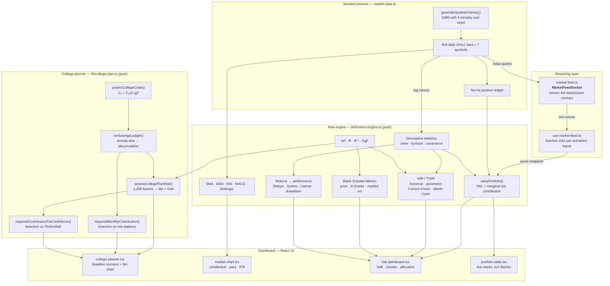
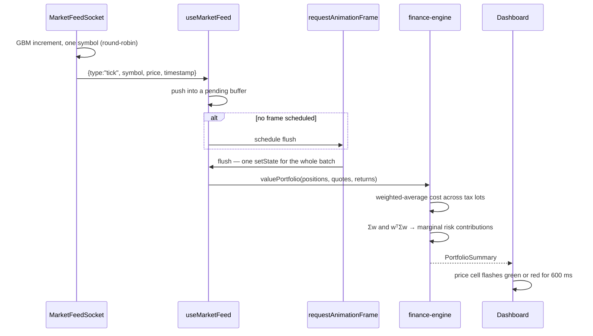

<div align="center">

# FinHub Tracker — Student Finance Planning Web App

**Plan four years of college the way an actuary would — every figure computed in your browser.**

[](https://nextjs.org)
[](https://www.typescriptlang.org)
[](https://react.dev)
[](https://tailwindcss.com)
[](https://motion.dev)
[](https://recharts.org)
[](./tests/finance-engine.test.ts)
[](./lib/college-plan.ts)
[](./lib/finance-engine.ts)

[📊 **Live demo**](https://finhubtracker-maudung.vercel.app) · [Risk engine](./lib/finance-engine.ts) · [Test suite](./tests/finance-engine.test.ts) · [MathForge →](https://github.com/dung037517-netizen/mathforge)

</div>

---

## What this is

A **student finance planning app** whose headline feature is a four-year college funding plan, and
whose engine is real actuarial machinery rather than a spreadsheet formula.

You give it a scenario — years until enrollment, current savings, monthly contribution, expected
return, cost inflation, expected aid — and it inflates the costs forward, accumulates the savings as
an **annuity-due**, draws them down semester by semester, and then stress-tests the whole thing
against 1,200 simulated market futures to tell you the one number a family actually wants:
*what is the chance this runs out?*

Underneath, the same engine powers a full quantitative risk desk: Value at Risk by four estimation
methods, Black-Scholes-Merton with a complete Greek surface, Wilder's RSI, and marginal risk
contributions from the covariance matrix — implemented from first principles in
[`lib/finance-engine.ts`](./lib/finance-engine.ts) and
[`lib/college-plan.ts`](./lib/college-plan.ts), with **no financial library behind any of it**.

> **On the data.** The tickers in the markets section are fictitious and their price history is
> generated from a seeded geometric Brownian motion. That is deliberate: it keeps every number in
> this README exactly reproducible, and avoids implying a market data licence this project does not
> hold. The *methods* are real; the prices are not. College cost figures are round, illustrative
> planning numbers — a family would substitute their own school's published cost of attendance.

---

## 💡 Actuarial Science & Math Foundation

> **A college savings plan is a pension in miniature.**
>
> It has an accumulation phase, a decumulation phase, an inflation assumption, an investment return
> assumption, and a solvency question at the end. Those are exactly the five ingredients of a
> defined-benefit pension valuation — which is why the AP-level mathematics behind this app is the
> same mathematics that prices retirement liabilities.
>
> | AP / high-school concept | How this app uses it |
> |---|---|
> | **Geometric sequences** | $C_k = C_0(1+g)^k$ inflates tuition forward. Compound growth, exactly as taught. |
> | **Annuity accumulation** | $\ddot{s}_{\overline{n}} = \frac{(1+i)^n - 1}{i}(1+i)$ — the future value of a monthly contribution stream. The test suite pins the ledger against this closed form. |
> | **Present value** | Costs are discounted back at the expected return to answer "what is four years of college worth *today*?" |
> | **Exponential / logarithms** | $r_m = (1+r)^{1/12} - 1$ converts an annual rate to a monthly one that compounds back exactly. |
> | **Normal distribution** (AP Stats) | Returns are lognormal, so $\ln$ returns are normal — the assumption behind both the fan chart and parametric VaR. |
> | **Expected value & variance** | Expected shortfall is $\mathbb{E}[\text{loss} \mid \text{loss} > 0]$: a conditional expectation, straight off the AP Statistics formula sheet. |
> | **Simulation** | 1,200 Monte Carlo futures turn a single point estimate into a distribution — the difference between "should be fine" and "fails 1 year in 5". |
>
> ### The insight the app is built to demonstrate
>
> Funding a plan to its **expected** return leaves roughly a **coin-flip** chance of falling short.
> Not 10%, not 20% — about 50%.
>
> The reason is that the arithmetic mean of a lognormal return path sits *above* its median: the
> average is dragged up by a thin upper tail that the typical investor never experiences. Planning
> to the average therefore plans to an outcome most futures never reach.
>
> The app makes this concrete with two solve buttons. "Fund the expected case" solves the
> deterministic break-even; "fund it 90% of the time" bisects on the *simulated shortfall
> probability*. Across the three built-in scenarios the second costs **36–44% more per month**
> (in-state $777 → $1,090; out-of-state $1,456 → $1,980; private $1,679 → $2,425).
>
> That gap is precisely what an actuarial **risk margin** is: the price of converting "probably
> fine" into "fine nine times out of ten". It is large here because a plan already holding
> significant savings carries five years of market exposure that contributions alone cannot offset.

---

## Zero cold start

The dashboard loads fully populated: a complete four-year scenario is already projected, the Monte
Carlo fan is drawn, two years of market history are charted, and the live feed is ticking. A
**🚀 Explore the sample scenario** button in the hero resets to the flagship plan and scrolls to it.

Measured cold load to network-idle: **~0.9 s**, with five charts rendered.

---

## System architecture



### How one tick reaches the screen



Batching matters: a 450 ms interval across seven symbols would otherwise schedule several
full-dashboard re-renders per second. With the buffer, React commits **at most once per frame**
however fast the feed runs.

---

## Financial formulas implemented

### College funding (the headline model)

Costs inflate geometrically from today's dollars, and the balance follows an annuity-due
accumulation that switches into decumulation once bills land:

$$C_k = C_0(1+g)^k, \qquad B_{t+1} = \bigl(B_t + PMT - W_t\bigr)(1 + r_m), \qquad r_m = (1+r)^{1/12} - 1$$

With no withdrawals this reduces to the standard future value of an annuity-due, which is exactly
what the test suite pins the ledger against:

$$\ddot{s}_{\overline{n}|} = \frac{(1+i)^n - 1}{i}\,(1+i)$$

Because contributions and withdrawals overlap once college starts, **there is no closed form** for
the required payment. It is solved by bisection on the minimum balance across the ledger — a
quantity monotone in $PMT$, so a bracketed search cannot diverge. The risk-adjusted version bisects
on the simulated shortfall probability instead:

$$PMT^{*}_{\alpha} = \inf\\{\,PMT : \mathbb{P}(\min_t B_t < 0) \le 1 - \alpha\,\\}$$

Shortfall risk reuses the same coherent measures as the trading book, applied to a savings goal:

$$\mathbb{E}[\text{shortfall}] = \mathbb{E}\left[-\min_t B_t \;\middle|\; \min_t B_t < 0\right]$$

### Value at Risk and Tail VaR

$$\mathrm{VaR}_\alpha = -\inf\\{\,x : P(R \le x) > 1-\alpha\,\\}, \qquad \mathrm{TVaR}_\alpha = -\mathbb{E}\left[R \mid R \le -\mathrm{VaR}_\alpha\right]$$

Four estimators, deliberately shown side by side because their disagreement *is* the lesson:

| Method | Estimator | What it assumes |
|---|---|---|
| **Historical** | empirical quantile of realised returns | nothing about shape — but cannot exceed the worst observed loss |
| **Parametric** | $-(\mu + \sigma z_{1-\alpha})$, with $\mathrm{TVaR} = -\left(\mu - \sigma\frac{\varphi(z)}{1-\alpha}\right)$ | returns are normal |
| **Cornish-Fisher** | $z' = z + \frac{(z^2-1)S}{6} + \frac{(z^3-3z)K}{24} - \frac{(2z^3-5z)S^2}{36}$ | corrects the normal quantile for skewness $S$ and excess kurtosis $K$ |
| **Monte Carlo** | resampled from a fitted normal, seeded | a convergence check on the parametric figure |

Multi-day horizons scale by $\sqrt{h}$, valid under the same i.i.d. assumption the parametric
measure already makes. TVaR is **subadditive and therefore coherent**; VaR is not, which is why
Solvency II and the Swiss Solvency Test are built on expected shortfall — the dashboard says so
where it is relevant.

### Black-Scholes-Merton

$$d_1 = \frac{\ln(S/K) + (r - q + \sigma^2/2)T}{\sigma\sqrt{T}}, \qquad d_2 = d_1 - \sigma\sqrt{T}$$

$$C = Se^{-qT}N(d_1) - Ke^{-rT}N(d_2), \qquad P = Ke^{-rT}N(-d_2) - Se^{-qT}N(-d_1)$$

The full Greek surface, first through third order:

| Greek | Definition | Quoted as |
|---|---|---|
| $\Delta$ | $\partial V/\partial S$ | shares per contract |
| $\Gamma$ | $\partial^2 V/\partial S^2$ | per unit of spot |
| $\nu$ (vega) | $\partial V/\partial\sigma$ | per 1 volatility point |
| $\Theta$ | $\partial V/\partial t$ | per calendar day |
| $\rho$ | $\partial V/\partial r$ | per 1 rate point |
| Vanna | $\partial^2 V/\partial S\,\partial\sigma$ | how delta moves with volatility |
| Volga | $\partial^2 V/\partial\sigma^2$ | convexity in volatility |
| Speed | $\partial^3 V/\partial S^3$ | rate of change of gamma |

**Put-call parity** is displayed live as a residual:

$$C - P - Se^{-qT} + Ke^{-rT} \overset{!}{=} 0$$

which makes the pricer self-checking — a wrong sign anywhere in the formula surfaces immediately
instead of hiding behind a plausible-looking number.

**Implied volatility** is recovered by Newton-Raphson on vega, *bracketed by bisection*. Newton
alone is fragile deep in and out of the money where vega collapses toward zero; keeping the bracket
means the solve either converges or reports `CONVERGENCE_FAILURE` honestly, and never returns a
wild number. No-arbitrage bounds are checked before the solve begins.

### Performance measurement

$$\text{Sharpe} = \frac{\bar{r} - r_f}{\sigma}\sqrt{252}, \qquad \text{Sortino} = \frac{\bar{r} - r_f}{\sigma_{\text{down}}}\sqrt{252}, \qquad \text{Calmar} = \frac{r_{\text{ann}}}{\mathrm{MDD}}$$

The annual risk-free rate is de-annualised to $(1+r_f)^{1/252} - 1$ before being netted off each
period's return — the step naive implementations skip.

### Marginal risk contribution

$$\mathrm{RC}_i = \frac{w_i(\Sigma w)_i}{w^{\mathsf{T}}\Sigma w}, \qquad \sum_i \mathrm{RC}_i = 1$$

Capital weight says how much you own; risk contribution says where the volatility actually comes
from. The dashboard plots them against each other, because a 4% position in a 68%-volatility asset
is not a 4% risk.

### Technical indicators

SMA, EMA seeded with the first window's SMA, **Wilder's** RSI (a $1/n$ exponential average of gains
and losses — materially different from the plain-SMA version after the first window, and the one
every trading platform actually quotes), MACD with signal and histogram, and Bollinger bands at
$\pm k$ sample standard deviations.

---

## Testing

```
✓ 63 tests passing
```

The suite pins the engine against values that can be checked independently:

| Assertion | Reference |
|---|---|
| ATM call, $S{=}K{=}100$, $r{=}5\%$, $\sigma{=}20\%$, $T{=}1$ | **10.450583572185565** (textbook) |
| Matching put | **5.573526022256971** |
| Put-call parity across 5 strikes × 3 volatilities | zero to $<10^{-9}$ |
| $\Delta$, $\Gamma$, $\nu$, $\rho$ | central finite differences of the pricer |
| Implied volatility over 4 vols × 3 strikes | round-trips to 5 decimals |
| Parametric VaR on 100,000 normal draws | $-(\mu + \sigma z_{0.01})$ |
| Historical vs parametric VaR on normal data | agree within 0.2% |
| $\mathrm{TVaR} \ge \mathrm{VaR}$ for all methods and confidences | coherence |
| Cornish-Fisher > parametric on a left-skewed sample | the correction does what it claims |
| $\sqrt{h}$ horizon scaling | exact ratio $\sqrt{10}$ |
| Max drawdown of $[+25\%, -40\%, +20\%]$ | exactly 40% |
| RSI on a monotone series | 100 up, 0 down, and $[0,100]$ on noise |
| Weighted-average cost across two tax lots | hand-computed 60.00 |
| Portfolio weights and risk contributions | each sums to 1 |
| Ledger with no withdrawals | the annuity-due closed form $\ddot{s}_{\overline{n}}$ |
| Monthly rate compounds back to the annual rate | exact to 12 decimals |
| Money conservation: contributions + growth − withdrawals | equals the ending balance |
| Cost inflation year over year | exactly $(1+g)$ per year |
| Solved contribution | closes the funding gap to $\le\$1$ |
| Confidence-funded contribution | strictly exceeds the deterministic one |
| Higher volatility | strictly raises the shortfall probability |
| Monte Carlo percentile bands | correctly ordered p10 ≤ p25 ≤ median ≤ p75 ≤ p90 |
| Identical seeds produce identical series | reproducibility |

```bash
npm test          # vitest run
npm run typecheck # tsc --noEmit
npm run lint      # eslint (flat config)
npm run build     # next build
```

---

## CS admission highlights

Things in this repository that a reviewer can verify by reading the code:

**A custom candlestick renderer.** Recharts has no candlestick primitive. `CandleShape` binds a bar
to the `[low, high]` range and converts all four OHLC prices back into pixels using the bar's own
geometry — which keeps the candle perfectly registered to the y-axis without reaching into
Recharts' internal scale. Up bars are hollow and down bars filled, so direction survives
colour-blindness.

**An interface designed for its future replacement.** `MarketFeedSocket` deliberately mirrors the
browser `WebSocket` surface: the same numeric `readyState` constants, `addEventListener`, `close()`.
Swapping the simulation for a live venue feed is a change of constructor, not a change of any
consumer.

**Numerical methods chosen for their failure modes, not their elegance.** Bisection-bracketed
Newton for implied volatility. Bessel-corrected variance and unbiased skew/kurtosis estimators.
The complementary error function evaluated *directly* by continued fraction rather than as
$1 - \mathrm{erf}(x)$, because the subtraction destroys precision exactly where VaR needs it — in
the far tail.

**Indicators computed on full history, then sliced.** Narrowing the timeframe from 1Y to 1M must not
restart a 50-day moving average. Most dashboards get this wrong; this one computes over the whole
series and slices the result.

**Correctness that is visible in the UI.** Put-call parity residual and $\bar{A}_x + \delta\bar{a}_x$
are rendered on screen. If the maths breaks, the page says so.

**Rendering discipline.** Ticks batched per animation frame; feed status derived from props rather
than mirrored through an effect; sorting applied to a copy so streaming updates never destabilise
row identity.

**Accessibility as structure, not retrofit.** Sortable columns expose `aria-sort`; tables carry
captions and `<th scope>`; every chart has an `aria-label`; gain and loss always pair colour with a
sign or an arrow; `prefers-reduced-motion` disables animation.

---

## Project structure

```
financeflow/
├── app/
│   ├── layout.tsx                # fonts, metadata, pre-paint theme script
│   ├── page.tsx
│   └── globals.css               # oklch tokens, gain/loss semantics
├── components/
│   ├── finance/
│   │   ├── college-planner.tsx   # 4-year scenario, fan chart, shortfall VaR
│   │   ├── market-chart.tsx      # candlestick · area · SMA · Bollinger · RSI
│   │   ├── risk-dashboard.tsx    # VaR · Greeks · allocation
│   │   ├── portfolio-table.tsx   # sortable, live tick flashes
│   │   ├── dashboard.tsx
│   │   ├── chart-tooltip.tsx
│   │   └── latex.tsx
│   ├── ui/                       # shadcn-style primitives on Radix
│   └── site/site-header.tsx
├── lib/
│   ├── finance-engine.ts         # the whole quantitative core
│   ├── college-plan.ts           # the student-facing planning engine
│   ├── market-feed.ts            # WebSocket-shaped simulated feed
│   ├── use-market-feed.ts        # frame-batched subscription hook
│   ├── market-data.ts            # seeded universe and demo book
│   ├── theme.ts
│   └── utils.ts
├── types/finance.ts              # the entire domain vocabulary
└── tests/finance-engine.test.ts
```

---

## Running locally

```bash
git clone https://github.com/dung037517-netizen/financeflow.git
cd financeflow
npm install
npm run dev      # http://localhost:3000
```

Requires Node.js 20 or newer.

---

## Related work

**[MathForge →](https://github.com/dung037517-netizen/mathforge)** — the actuarial counterpart:
symbolic calculus with step-by-step derivations, parametric survival models, life contingencies,
and non-blocking Monte Carlo in a Web Worker.

<div align="center">
<sub>Synthetic market data, real quantitative methods. Not investment advice.</sub>
</div>
