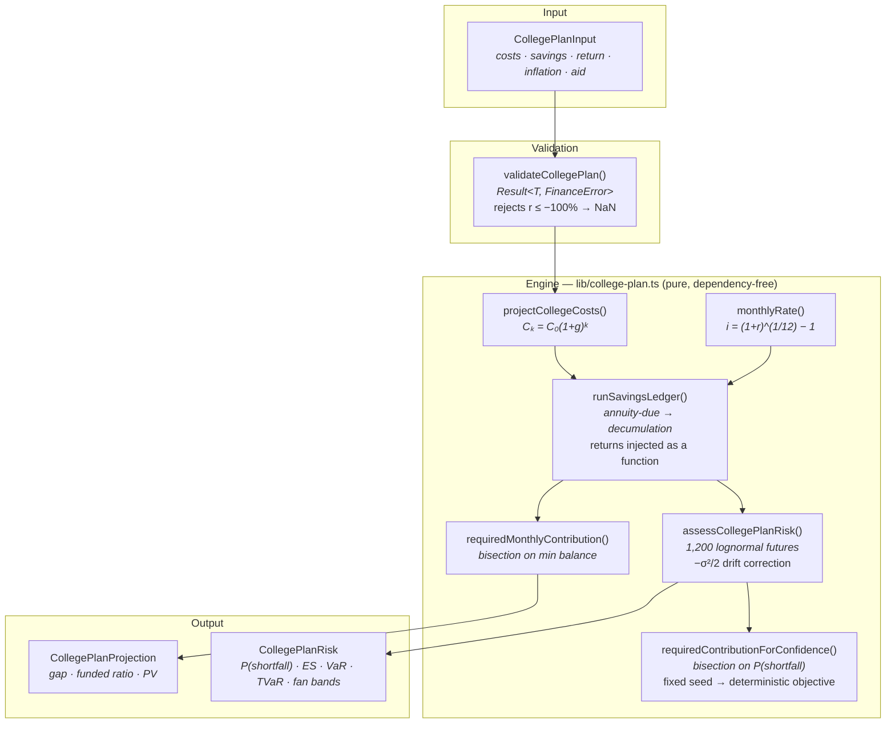

<div align="center">

# FinHub Tracker

**A four-year college funding plan, valued the way an actuary values a pension.**

[](https://github.com/dung037517-netizen/finhub-tracker/actions/workflows/ci.yml)
[](./tsconfig.json)
[](./lib/college-plan.ts)

[**Live demo**](https://finhubtracker-maudung.vercel.app) ·
[**Derivations**](./DERIVATION.md) ·
[**Postmortems**](./POSTMORTEM.md) ·
[**Engine**](./lib/college-plan.ts)

</div>

---

## The problem

My family could not answer a question that mattered: *can we afford four years of
university abroad?*

A spreadsheet gives one number, and that number is a lie of omission. It cannot
express **uncertainty**. It says "you will have $104,000" when the honest answer
is "you will have somewhere between $60,000 and $150,000, and the chance you run
out in year three is 21%."

So I modelled it the way an actuary models a pension — because structurally that
is what it is.

---

## The finding

> **Funding a college savings plan to its *expected* return leaves roughly a
> coin-flip chance of falling short.**

Not 10%. About 50%.

The arithmetic mean of a lognormal return path sits **above** its median — the
average is inflated by a thin upper tail the typical path never visits. Planning
to the average is planning to an outcome most futures never reach.

Closing that gap to 90% confidence costs **36–44% more per month**:

| Scenario | Fund the expected case | Fund it 90% of the time | Risk margin |
|---|---:|---:|---:|
| In-state public | $777/mo | $1,090/mo | **+40%** |
| Out-of-state public | $1,456/mo | $1,980/mo | **+36%** |
| Private | $1,679/mo | $2,425/mo | **+44%** |

That gap **is** an actuarial risk margin — the same loading Solvency II and
IFRS 17 require above a best-estimate liability.
[Full derivation →](./DERIVATION.md#4-lognormal-returns-and-why-the-risk-margin-is-unavoidable)

---

## How This Was Built & Transparency Statement

This project was built with substantial AI assistance (Claude), and the git
history shows that openly — most of the initial implementation was AI-authored.

I state this plainly because the alternative is worse. A reviewer can read the
commit log in thirty seconds, and a portfolio that hides how it was made is not
evidence of anything.

What I claim is narrower, and true:

- **I chose the problem.** This model exists because my own family could not
  answer whether four years abroad was affordable.
- **I own the mathematics.** [`DERIVATION.md`](./DERIVATION.md) works through
  every result the engine depends on — the annuity-due identity, why bisection
  is the only valid solver here, and why the median–mean gap makes a risk margin
  unavoidable. It also lists **four open questions I have not resolved**.
- **I own the incident record.** [`POSTMORTEM.md`](./POSTMORTEM.md) documents
  where I got things wrong, including a published figure that was wrong by 3×
  and a test whose expected value was itself incorrect.
- **I can defend every design decision.** Ask me why bisection instead of
  Newton-Raphson: the objective is a pointwise minimum of affine functions, so it
  is continuous and monotone but **kinked** — Newton needs a derivative that does
  not exist at the kinks and vanishes on the flat stretches between them.
  Bisection needs only a sign change, and cannot diverge.

Using AI to build past my current ability, then working backwards until I
understood what it built, was a deliberate choice about how to learn quickly. I
would rather be judged on that than on a smaller project I could have written
alone.

---

## Architecture



**The design decision that matters:** `runSavingsLedger` takes returns as an
**injected function**, not a fixed rate. The deterministic projection passes a
constant; Monte Carlo passes sampled values. One ledger serves both — so there is
no second implementation that could drift out of agreement with the first.

---

## System insights

**1. The ledger is pinned to a closed form.**
With withdrawals removed it must equal $\ddot{s}_{\overline{n}|i}$ exactly. That
single test is the strongest guarantee the accumulation logic is right.

**2. Zero volatility is the best test of the drift correction.**
At $\sigma = 0$ the lognormal degenerates to its drift, so **every percentile
must collapse onto the deterministic path**. If the $-\sigma^2/2$ term were
missing, this test fails immediately — and no other test would catch it.

**3. Fixing the Monte Carlo seed is what makes the confidence solver converge.**
Bisecting on a *noisy* objective oscillates: the sign test flips on sampling
noise rather than on the true crossing. A fixed seed turns the estimate into a
deterministic step function.

**4. The funding gap is measured at peak strain, not at the end.**
A plan that runs dry in year three and recovers by graduation has still failed.
Reporting the ending balance alone would hide that.

---

## Running locally

```bash
git clone https://github.com/dung037517-netizen/finhub-tracker.git
cd finhub-tracker
npm install

npm run dev        # http://localhost:3000
npm test           # 98 tests
npm run typecheck  # tsc --noEmit, strict
npm run lint
npm run build
```

Requires Node.js 20+.

---

## On the data

Market tickers in the portfolio section are **fictitious** and their history is
generated from a seeded geometric Brownian motion. Deliberate: it keeps every
number in this README exactly reproducible, and avoids implying a market-data
licence this project does not hold.

**The methods are real. The prices are not.** College cost figures are round
illustrative planning numbers — a family would substitute their own school's
published cost of attendance.

**This is not financial advice.**

---

<div align="center">
<sub><a href="./DERIVATION.md">Derivations</a> · <a href="./POSTMORTEM.md">Postmortems</a> · <a href="https://github.com/dung037517-netizen/mathforge">MathForge →</a></sub>
</div>
