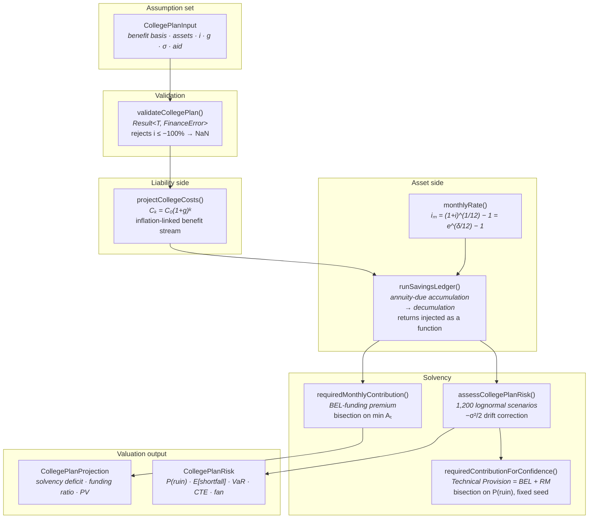

<div align="center">

# FinHub Tracker

### A Personal Asset-Liability Management & Solvency Framework

**Treating four years of university as a defined-benefit liability, and funding it
the way a pension actuary would.**

[](https://github.com/dung037517-netizen/finhub-tracker/actions/workflows/ci.yml)
[](./tsconfig.json)
[](./lib/college-plan.ts)

[**Live demo**](https://finhubtracker-maudung.vercel.app) ·
[**Actuarial derivations**](./DERIVATION.md) ·
[**Model risk log**](./POSTMORTEM.md) ·
[**Engine**](./lib/college-plan.ts)

</div>

---

## The problem

My family could not answer a question that mattered: *can we afford four years of
university abroad?*

A spreadsheet gives one number, and that number is a lie of omission. It cannot
express **uncertainty**. It says "you will have $104,000" when the honest answer
is "you will have somewhere between $60,000 and $150,000, and the probability
you fail to meet a tuition payment in year three is 21%."

So I stopped treating it as a savings problem and modelled it as what it
structurally is: a **defined-benefit liability funded by a risky asset
portfolio** — an ALM problem, valued with pension and life-insurance technique.

---

## The actuarial framing

| Household object | Actuarial object |
|---|---|
| Tuition, room, board, travel | **Liability stream** $\{W_t\}$, inflation-linked |
| Savings and investments | **Asset portfolio** $A_t$ |
| Monthly contribution | **Level premium** $P$ |
| Fund fails to meet a payment | **Ruin event**, $\min_t A_t < 0$ |
| Contribution at expected return | Funding the **Best Estimate Liability** |
| Extra loading for confidence | **Risk Margin** |
| BEL + Risk Margin | **Technical Provision** |

The plan has an **accumulation phase**, a **decumulation phase**, an inflation
assumption, a stochastic return assumption, and a solvency test at every payment
date. Those are the five ingredients of a defined-benefit valuation. Nothing here
is a metaphor — the mathematics is identical, only the scale differs.

---

## The finding

> **Funding the plan to its Best Estimate leaves roughly a coin-flip probability
> of ruin.**

Not 10%. About 50%.

Asset returns are lognormal, and for a lognormal variable the **median lies
strictly below the mean**:

$$\frac{\mathbb{E}[Y]}{\text{Median}(Y)} = e^{\sigma^2/2} > 1$$

The arithmetic average is inflated by a thin upper tail the typical scenario
never visits. Funding to the average is funding to an outcome most futures never
reach — which is precisely why **Solvency II does not permit a technical
provision set at best estimate.**

Closing that gap to 90% confidence requires a Risk Margin of **36–44%**:

| Scenario | $P^\star$ (BEL) | $P_{0.90}$ (Technical Provision) | Risk Margin |
|---|---:|---:|---:|
| In-state public | $777/mo | $1,090/mo | **+40%** |
| Out-of-state public | $1,456/mo | $1,980/mo | **+36%** |
| Private | $1,679/mo | $2,425/mo | **+44%** |

That loading is a Risk Margin in the exact Solvency II and IFRS 17 sense: the
provision above best estimate that converts *"probably adequate"* into
*"adequate with stated confidence."*
[Full derivation →](./DERIVATION.md#4-lognormal-asset-returns-and-the-risk-margin)

---

## How This Was Built & Transparency Statement

This project was built with substantial AI assistance (Claude), and the git
history shows that openly — most of the initial implementation was AI-authored.

I state this plainly because the alternative is worse. A reviewer can read the
commit log in thirty seconds, and a portfolio that hides how it was made is not
evidence of anything.

What I claim is narrower, and checkable:

- **I chose the problem.** This model exists because my own family could not
  answer whether four years abroad was affordable, and no spreadsheet could
  express the uncertainty honestly.
- **I own the actuarial mathematics.** [`DERIVATION.md`](./DERIVATION.md) works
  through every result the engine depends on in International Actuarial
  Notation — the annuity-due identity $\ddot{s}_{\overline{n}\rvert i} =
  \frac{(1+i)^n-1}{d}$, a proof that the solvency objective is monotone but
  non-differentiable, and the lognormal median–mean gap that makes a Risk Margin
  unavoidable. It also documents **five model limitations I have not resolved.**
- **I own the model risk record.** [`POSTMORTEM.md`](./POSTMORTEM.md) analyses
  five incidents under the MRM framework, including a disclosed Risk Margin that
  was wrong by a factor of three, and a validation oracle that was itself
  incorrect.
- **I can defend every design decision.** Ask me why bisection rather than
  Newton-Raphson: the solvency objective is a pointwise minimum over a family of
  affine functions, so it is continuous and strictly monotone but **kinked**
  wherever the binding payment date moves. Newton requires a derivative that does
  not exist at those kinks and vanishes on the flat stretches between them.
  Bisection needs only a sign change, and cannot diverge.

Using AI to build past my current ability, then working backwards until I
understood what it built, was a deliberate choice about how to learn quickly. I
would rather be judged on that than on a smaller project I could have written
alone.

---

## Architecture



**The design decision that matters:** `runSavingsLedger` takes returns as an
**injected function**, not a fixed rate. The deterministic valuation passes a
constant; the stochastic valuation passes sampled values. One ledger serves both
— so there is no second implementation that could drift out of agreement with
the first. In MRM terms, a single validated computational kernel rather than two
models requiring reconciliation.

---

## System insights

**1. The ledger is anchored to a closed-form actuarial identity.**
With benefit outgo removed it must equal $\ddot{s}_{\overline{n}\rvert i} =
\frac{(1+i)^n - 1}{d}$ exactly, where $d = i/(1+i)$ is the rate of discount.
That single test is the strongest guarantee the accumulation logic is right, and
it also confirms the annuity is **due** rather than immediate — the two differ
by a factor of exactly $(1+i)$.

**2. Zero volatility is the strongest test of the drift correction.**
At $\sigma = 0$ the lognormal degenerates to its drift, so **every percentile
must collapse onto the deterministic projection**. Omit the $-\sigma^2/2$ term
and this test fails immediately — while no other test in the suite would catch
it, and every reported solvency figure would be optimistic.

**3. Fixing the simulation seed is what makes the Risk Margin solver converge.**
Bisecting on a *noisy* Monte Carlo objective oscillates: the sign test flips on
sampling error rather than at the true crossing. A fixed seed turns the ruin
probability into a deterministic monotone step function. Reproducibility here is
a mathematical requirement, not merely good governance.

**4. Solvency is tested at every payment date, not at run-off.**
A fund that exhausts its assets in year three and recovers by graduation has
still defaulted on a benefit payment in year three. The deficit is measured at
the point of greatest strain, $\min_t A_t$ — reporting only the terminal position
would conceal a genuine insolvency event.

**5. CTE, not VaR alone.**
VaR is not subadditive: it can assert that diversification increases risk. CTE
(Conditional Tail Expectation) satisfies all four coherence axioms of Artzner et
al., which is why Solvency II and the SOA syllabus are built on it. A 5% chance
of a \$2,000 deficit and a 5% chance of a \$90,000 deficit have identical VaR and
utterly different CTE.

---

## Running locally

```bash
git clone https://github.com/dung037517-netizen/finhub-tracker.git
cd finhub-tracker
npm install

npm run dev        # http://localhost:3000
npm test           # 98 tests
npm run typecheck  # tsc --noEmit, strict
npm run lint
npm run build
```

Requires Node.js 20+.

---

## Assumption basis and disclosure

Market tickers in the portfolio section are **fictitious** and their history is
generated from a seeded geometric Brownian motion. This is deliberate: it keeps
every figure in this document exactly reproducible by a third party, and avoids
implying a market-data licence this project does not hold.

**The methods are real. The prices are not.** Cost figures are round,
illustrative planning assumptions — a family would substitute their own
institution's published cost of attendance.

Model limitations are documented in [`DERIVATION.md` §5](./DERIVATION.md#5-limitations-of-the-model),
including that i.i.d. returns almost certainly **understate** tail risk.

**This is not financial advice.**

---

<div align="center">
<sub><a href="./DERIVATION.md">Actuarial derivations</a> · <a href="./POSTMORTEM.md">Model risk log</a> · <a href="https://github.com/dung037517-netizen/mathforge">MathForge →</a></sub>
</div>
